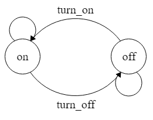
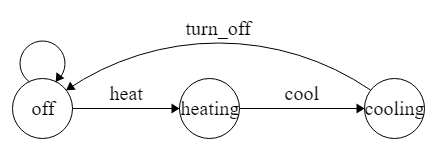
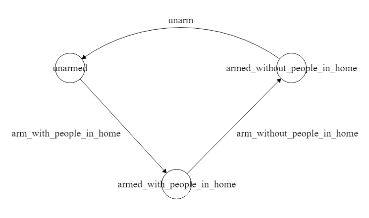

# Smart House

Nesta implementação do sistema de uma casa inteligente temos:

implementação convencional:

```
sh = SmartHouse.get_instance() # unica instancia de SmartHouse
sh2 = SmartHouse() # erro ao criar uma segunda instancia

observer = Observer()
sh.add(observer) # adiciona um observer à SmartHouse

sh.limit = 3 # seta o limite da SmartHouse pra 3

sh.add_device('light')  
>>> o camarada adicionou uma luz na sua smart house

sh.add_device('thermostat')
>>> o camarada adicionou um termostato na sua smart house

sh.add_device('security_system')
>>> o camarada adicionou um sistema de segurança na sua smart house

sh.add_device('light')
ta cheio compadre, pode dale mais nenhuma luz aq n

print(sh.get_all_devices())
>>> ['light', 'thermostat', 'security_system']

print(sh.count_all_on_devices())
>>> 0 # não tem nenhum dispositivo ligado até então

print(sh.get_all_device_status())
>>> ['off', 'off', 'off']

sh.turn_on_all_lights() #liga todas as luzes

print(sh.get_all_device_status())
>>> ['on', 'off', 'off']

print(sh.count_all_on_devices())
>>> 1

print(sh.get_all_on_devices())
>>> ['light']

print(sh.get_all_devices())
>>> ['light', 'thermostat', 'security_system']
```


passando o limite de dispositivos por linha de comando:

```
usage: python main.py [<set_limit> limit]

# caso o usuário execute o código com 'python main.py comoqescrev'
>>> `comoqescrev` is not recognized as an internal or external command, operable program or batch file.

#maneira correta:
python main.py set_limit 5
```

A partir daí vai ser possível:

```
# considerando para os próximos exemplos que na casa tenha 
  uma luz, um termostato e um sistema de segurança
```


* verificar o status dos dispositivos
```
print(sh.get_all_device_status())
>>> [['light', 'off'], ['thermostat', 'off'], ['security_system', 'off']]
```
* controlar um dispositivo especifico
```
print(sh.get_all_devices())
>>> [(0, 'light'), (1, 'thermostat'), (2, 'security_system')] 
# qual dispositivo você deseja controlar?

# caso queira controlar o termostato, digite 1
>>>               <<< Thermostat Menu >>>

[1] heat
[2] cool
[3] turn off

#caso queira diminuir a temperatura do termostato, digite 2
# o termostato irá ligar após essa operação

print(sh.get_all_device_status())
>>> [['light', 'off'], ['thermostat', 'on'], ['security_system', 'off']]
```
* adicionar um novo dispositivo 
```
# caso queira adicionar um termostato, digite 2
>>>                <<< Device Menu >>>

[1] light
[2] thermostat
[3] security system
[0] back

```
* remover um dispositivo da casa
```
print(sh.get_all_devices())
>>> [(0, 'light'), (1, 'thermostat'), (2, 'security_system')]

# qual dispositivo você deseja remover?

# caso seja a luz, digite 0

print(sh.get_all_devices())
>>> [(0, 'thermostat'), (1, 'security_system')]

# qual dispositivo você deseja remover?

# caso você digite 5

>>> dispositivo não encontrado

print(sh.get_all_device_status())
>>> [['thermostat', 'off'], ['security_system', 'off']]
```
* informações diversas dos dispositivos
```
                      <<< Misc Menu >>>

[1] get all on devices
[2] count all on devices
[0] back

# aqui é possível obter todos os dispositivos que estão ligados

print(sh.get_all_device_status())
>>> [['light', 'on'], ['thermostat', 'off'], ['security_system', 'on']]

print(sh.get_all_on_devices())
>>> ['light', 'security_system']

# também é possível obter a quantidade de dispositivos que estão ligados

print(f"{sh.count_all_on_devices()} {'dispositivo está' if sh.count_all_on_devices() == 1 else 'dispositivos estão'} ligado(s)")

>>> 2 dispositivos estão ligado(s)
```


## Máquinas de Estado
Aqui estão as maquinas de estado que foram consideradas no projeto da casa inteligente de cada dispositivo.
### Máquina de estados da Luz


### Máquina de estados do Termostato


### Máquina de estados do Sistema de segurança

